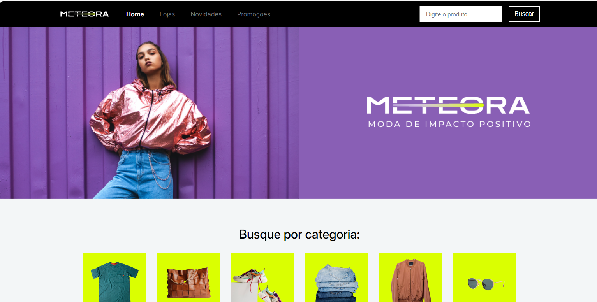

# Meteora

[LINK PARA O FIGMA](https://www.figma.com/design/Pq3M0Bt5Rsl8Y7yHY4bGrc/Meteora---Projeto-Bootstrap-5?node-id=2386-3188&t=by36dYLblQCD3MQK-1)

[LINK PARA O SITE FUNCIONANDO](https://gutoffline.github.io/meteora)

**Descrição curta do projeto:**  
Site para uma loja de roupas fictício. O objetivo é treinar a programação de layouts.

---

## 🚀 Tecnologias Utilizadas

- **HTML5** — Estrutura básica da página.
- **CSS3** — Estilos e design responsivo.

---

## 📸 Imagens do Projeto

Aqui você pode colocar capturas de tela ou imagens do seu projeto para ilustrar como ele se parece. Para adicionar imagens no seu README, use:

## 💬 Contato
### Guto Xavier - [contato@gutoxavier.com.br](mailto:contato@gutoxavier.com.br)

